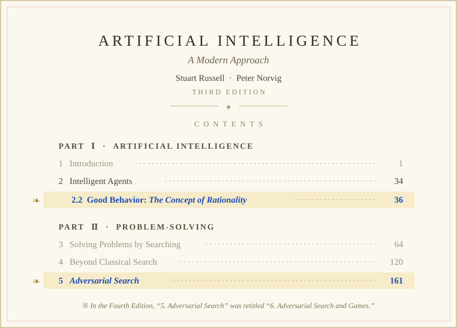

<div align="center">

<br>

# 경01 Min · Sophia Min

<em>Philo_Sophia_Min_Max</em>

</div>

<br>

## Ⅰ. &nbsp;My Goal or Objective

> *Whenever I was having a hard time, I reminded myself of this and got back on my feet.*

<h4 align="center"><em>Optimizing objective functions</em></h4>

```math
\huge X^{\star} = \underset{X' \in \mathcal{X}}{\arg\min} F\left(X'\right).
```

&nbsp;&nbsp;&nbsp;&nbsp;$`{\color{#1f4bb8}\textbf{minimizing}}^{1}`$

&nbsp;&nbsp;&nbsp;&nbsp;an $`{\color{#1f4bb8}\textbf{objective function}}`$ $`F(X)`$

&nbsp;&nbsp;&nbsp;&nbsp;$`{\color{#1f4bb8}\textbf{configurations}}`$, $`\mathcal{X}`$

<br>

---

## Ⅱ. &nbsp;I like the words *“Behavio(u)r / Action ”* and *“Adversarial Search”*

> *Adversarial search: Ever since I was young, I enjoyed learning about things that held completely opposite information.*

<div align="center">

<br>



</div>

<br>

---

## Ⅲ. &nbsp;I like anything that utilizes AI

<div align="center">

<br>

**LLM** &nbsp;·&nbsp; **NLP** &nbsp;·&nbsp; **RAG** &nbsp;·&nbsp; **Search &amp; Optimization** &nbsp;·&nbsp; **Digital Twin** &nbsp;·&nbsp; ⋯

<br>

</div>
